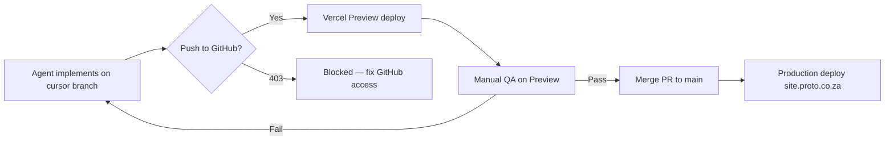

# Portal (Proto-Website-) — Cloud Agent deployment workflow

Operational guide for RC1 and all portal work where Cursor Cloud Agents must push branches and trigger Vercel Preview deployments.

## Problem

| Repo | Cursor push | Vercel preview |
|------|-------------|----------------|
| `protoportal-admin` | Works | `protoportal-admin.vercel.app` |
| `Proto-Website-` | **403 — `cursor[bot]` denied** | Blocked until branch is on GitHub |

Without push access, agents can implement and build locally but cannot open PRs or trigger Vercel Preview URLs for manual QA.

---

## Required outcome

1. Cursor pushes `cursor/*-14cd` feature branches to `Proto-Website-`
2. Vercel (`protoportal-main` project) auto-creates Preview deployments on branch push
3. Manual RC1 QA runs against Preview URL only
4. Merge to `main` only after QA approval

---

## Fix A — Grant Cursor GitHub App access (recommended)

**Who:** GitHub org owner/admin for `danieljoffeinfo-web` + Cursor team admin

### 1. GitHub — install or update Cursor app

1. Open [github.com/apps/cursor](https://github.com/apps/cursor) → **Configure**
2. Select organization **danieljoffeinfo-web**
3. Under **Repository access**, choose either:
   - **All repositories**, or
   - **Only select repositories** and include **`Proto-Website-`** (and `protoportal-admin`)
4. Save

### 2. GitHub — org third-party access

1. GitHub → **danieljoffeinfo-web** → **Settings** → **Third-party access**
2. Approve **Cursor** if pending

### 3. GitHub — IP allow list (if enabled)

If the org uses GitHub IP allow lists:

1. **Settings** → **Security** → **IP allow list**
2. Enable **Allow access by GitHub Apps**, or add Cursor proxy IPs per [Cursor GitHub docs](https://cursor.com/docs/integrations/github)

### 4. Cursor dashboard — reconnect GitHub

1. [cursor.com/dashboard](https://cursor.com/dashboard) → **Integrations**
2. **GitHub** → **Manage** → confirm `Proto-Website-` is listed
3. If unsure, **Disconnect** and **Connect** again

### 5. Verify

Re-run a Cloud Agent task on `Proto-Website-` or execute locally:

```bash
node scripts/verify-portal-github-access.mjs
```

Expected: `Proto-Website- push: ALLOWED`

---

## Fix B — GH_TOKEN fallback (if Fix A is insufficient)

Add a Personal Access Token to Cloud Agent secrets when the installation token lacks write scope.

### 1. Create PAT (classic)

GitHub → **Settings** → **Developer settings** → **Personal access tokens** → **Tokens (classic)**

Scopes:

- `repo` (full control of private repositories)
- `workflow` (if GitHub Actions are added later)

### 2. Add to Cursor

1. [cursor.com/dashboard](https://cursor.com/dashboard) → **Cloud Agents** → **Secrets**
2. Add secret: `GH_TOKEN` = your PAT

Agents use this for git push when the default installation token is restricted.

---

## Vercel Preview (automatic after push works)

| Item | Value |
|------|-------|
| GitHub repo | `danieljoffeinfo-web/Proto-Website-` |
| Vercel project | `protoportal-main` |
| Production | `site.proto.co.za` (merge to `main`) |
| Preview trigger | Push any branch; PR optional but recommended |

Preview URL pattern:

`https://protoportal-main-<hash>-danieljoffeinfo-1253s-projects.vercel.app`

Team previews may require Vercel SSO login.

### Manual CLI deploy (emergency only)

```bash
export VERCEL_TOKEN=<from vercel.com/account/tokens>
export VERCEL_MAIN_PROJECT_ID=<protoportal-main project id>
export VERCEL_ORG_ID=team_eCbNLKm2ZVG4tK6WSXq7vzbr
npm run build
node scripts/deploy-portal-preview.mjs   # in Proto-Website- repo
```

---

## RC1.1 branch (ready to push)

| Field | Value |
|-------|-------|
| Branch | `cursor/rc1-refinement-14cd` |
| Tip commit | `94ff73c` (C-01, C-02, C-03) |
| Local clone | `/tmp/proto-website` on agent VM |
| Patches | `/workspace/scripts/0001–0005-fix-rc1-*.patch` |

### One-time manual push (until Fix A/B applied)

```bash
cd Proto-Website-
git fetch origin
git checkout -b cursor/rc1-refinement-14cd   # or fetch from agent bundle
# apply patches if needed: git am /path/to/scripts/000*.patch
git push -u origin cursor/rc1-refinement-14cd
```

Open draft PR → Vercel bot comments Preview URL → manual QA → merge after approval.

---

## RC1 QA gate (preview only)

Do **not** QA against `site.proto.co.za` for unreleased RC1 changes.

Checklist on Preview URL:

- [ ] `glass`, `beads`, `pen` — autocomplete matches catalogue
- [ ] Partial SKU, barcode — consistent
- [ ] Categories appear while typing
- [ ] API fallback identical (block `/api/products` in DevTools)
- [ ] Tablet 901–1100px search reachable (C-01)
- [ ] No spinner between keystrokes (C-02)

---

## Workflow diagram



---

## Rollback

- **Before merge:** close PR; production unchanged
- **After merge:** `git revert` on `main`; Vercel redeploys production
